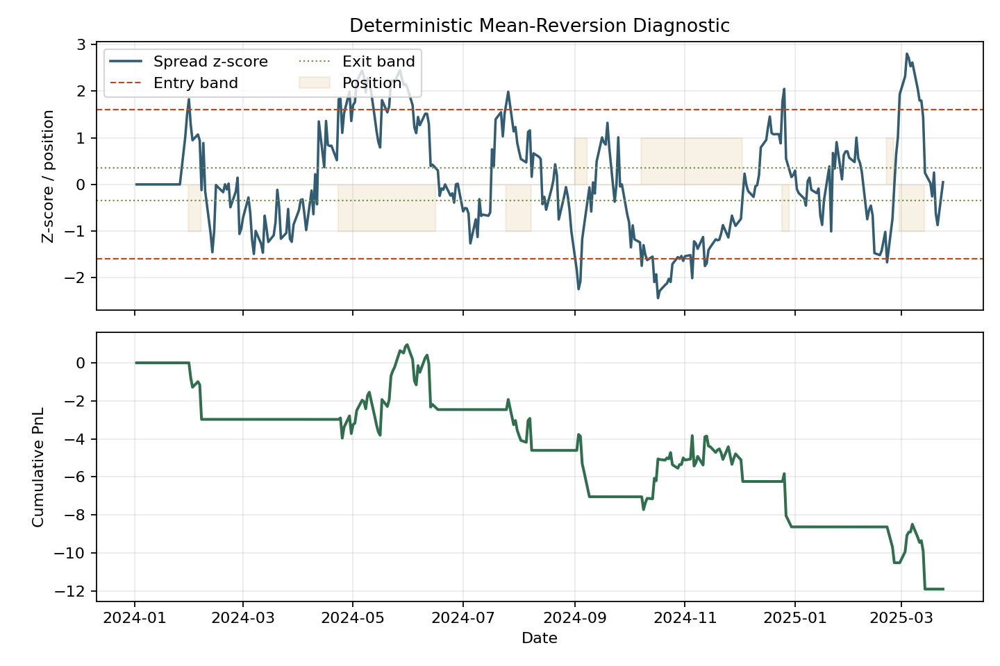

# Statistical Arbitrage Research Engine

A Python research platform for mean-reversion statistical arbitrage across equities and futures.

The project is organized around a production research workflow: market data normalization, candidate discovery, signal calibration, portfolio construction, risk controls, backtest accounting, and reporting. The current implementation focuses on reliable primitives and clear module boundaries so the engine can grow without turning into a collection of notebooks or oversized scripts.

## Scope

- Cointegration screening for pair and basket candidates.
- Ornstein-Uhlenbeck calibration for spread half-life, long-run mean, and volatility.
- Kalman-filtered dynamic hedge ratios for changing relationships.
- Convex portfolio construction with leverage, beta-neutrality, and turnover constraints.
- Entry and exit threshold objects for mean-reversion signals.
- Backtests with transaction costs, borrow costs, slippage, walk-forward validation, and bootstrap stress tests.

## Design Principles

- Keep research methods isolated from IO and reporting.
- Prefer typed configuration objects over loose dictionaries.
- Model costs and constraints explicitly instead of hiding them in backtest loops.
- Make every layer testable with synthetic data before connecting live data sources.
- Keep public APIs small while allowing internal modules to evolve.

## Quick Start

```bash
python -m venv .venv
source .venv/bin/activate
pip install -e ".[dev]"
pytest
```

Run the daily maintenance check:

```bash
python scripts/daily_research_check.py
```

Generate the deterministic sample report artifacts:

```bash
python scripts/generate_sample_report.py
```

## Sample Results

The chart below is generated from a deterministic synthetic mean-reverting
spread. It is included because it exercises real project logic: threshold
classification, position state, transaction-cost-aware PnL, and reporting.



## Project Layout

```text
src/stat_arb_engine/
  backtesting/        Engines, cost models, metrics, stress tests
  data/               Data contracts, loaders, validation
  domain/             Shared research dataclasses and instruments
  execution/          Slippage, borrow, and transaction cost assumptions
  portfolio/          Optimizers, constraints, and exposure accounting
  reporting/          Research summaries and diagnostics
  research/           Cointegration, OU calibration, Kalman filters
  risk/               Exposure, drawdown, and capacity controls
  signals/            Entry/exit rules and signal state
  utils/              Time, arrays, and validation helpers
scripts/
  daily_research_check.py
tests/
  backtesting/
  portfolio/
  research/
```

See `docs/architecture.md` for the intended growth path.

## Notes

This is research software, not investment advice. Backtest results are not guarantees of live performance.
